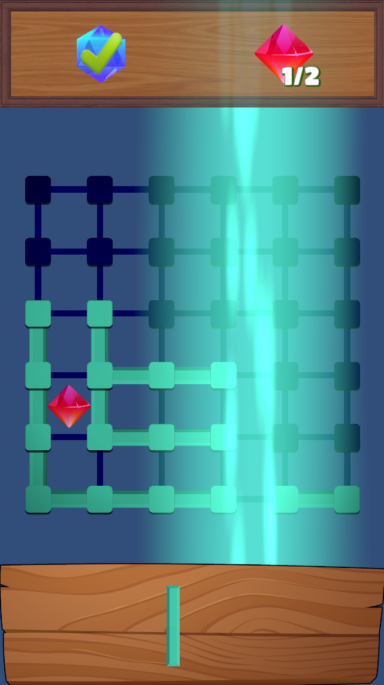

# Stick Blast

Stick Blast is a puzzle game inspired by Block Blast. In this game, players strategically place sticks of various shapes to fill and clear rows or columns on a grid. When a cell is completely surrounded by sticks, it gets filled (or painted). Completing an entire row or column of filled cells triggers an explosive blast to clear that space, allowing fluid and continuous gameplay.

Made with Unity 2022.3.25f1

## Game Overview

- **Stick Placement**  
  Players use sticks of different shapes (e.g., “I,” “L,” “U”) to create connections between grid dots.

- **Cell Filling**  
  Cells become painted when they are fully encircled by sticks.

- **Row/Column Blasting**  
  When a row or column is entirely filled, a blast is triggered to clear those cells, making room for new moves.

## Technical Structure

The project is organized into several key modules:

- **Core Gameplay Management**  
  - The [`GameManager`](Assets/StickBlast/Scripts/Core/GameManager.cs) class manages the overall game state (Playing, Won, Lost), plays background music using `SoundManager`, and handles UI updates via [`UIManager`](Assets/StickBlast/Scripts/UI/Gameplay/).

- **Level Management**  
  - The [`LevelManager`](Assets/StickBlast/Scripts/Level/LevelManager.cs) class is responsible for starting levels and managing level transitions.
  - New levels are added as Scriptable Objects in the `ScriptableObjects/Levels/` directory (e.g., [Level1.asset](ScriptableObjects/Levels/Level1.asset), [Level2.asset](ScriptableObjects/Levels/Level2.asset)).

- **Grid and Stick Mechanics**  
  - The grid and stick placement logic is handled by several modules under `Scripts/Level/Grid/`:
    - [`GridManager`](Assets/StickBlast/Scripts/Level/Grid/Core/GridManager.cs) – Initializes the grid and manages gameplay interactions like stick placement.
    - [`PlacementManager`](Assets/StickBlast/Scripts/Level/Grid/Core/GridPlacementManager.cs) – Simulates stick placement and determines when rows or columns are completed.
    - Additional modules such as [`Cell`](Assets/StickBlast/Scripts/Level/Grid/Cells/Cell.cs) and [`BlastManager`](Assets/StickBlast/Scripts/Level/Grid/Cells/BlastManager.cs) handle cell states and blast effects.
  - Other components ensuring proper grid functionality include:
    - [`GridInitializer`](Assets/StickBlast/Scripts/Level/Grid/Core/GridInitializer.cs) – Responsible for creating dots, connections, and cells.
    - [`GridLayoutController`](Assets/StickBlast/Scripts/Level/Grid/Core/GridLayoutController.cs) – Manages dynamic scaling and positioning of the grid.
    - [`GridValidator`](Assets/StickBlast/Scripts/Level/Grid/Core/GridValidator.cs) – Validates stick placements and grid connections.

- **UI and Feedback**  
  - The [`UIManager`](Assets/StickBlast/Scripts/UI/Gameplay/) along with other UI scripts manage pop-ups and user feedback for win/lose conditions.

- **Scriptable Objects for Configurations**  
  - **Levels:** Define new levels using Scriptable Objects in the `ScriptableObjects/Levels/` folder.
  
  - **Stick Definitions:** Create and manage stick shapes as Scriptable Objects in the `ScriptableObjects/StickDefinitions/` folder (e.g., [IIx2.asset](ScriptableObjects/StickDefinitions/IIx2.asset), [Qx2.asset](ScriptableObjects/StickDefinitions/Qx2.asset)).
  
  - **Win Conditions:** Configure win conditions as Scriptable Objects (stored in `ScriptableObjects/WinConditions/`) which are then referenced by the level definitions.
